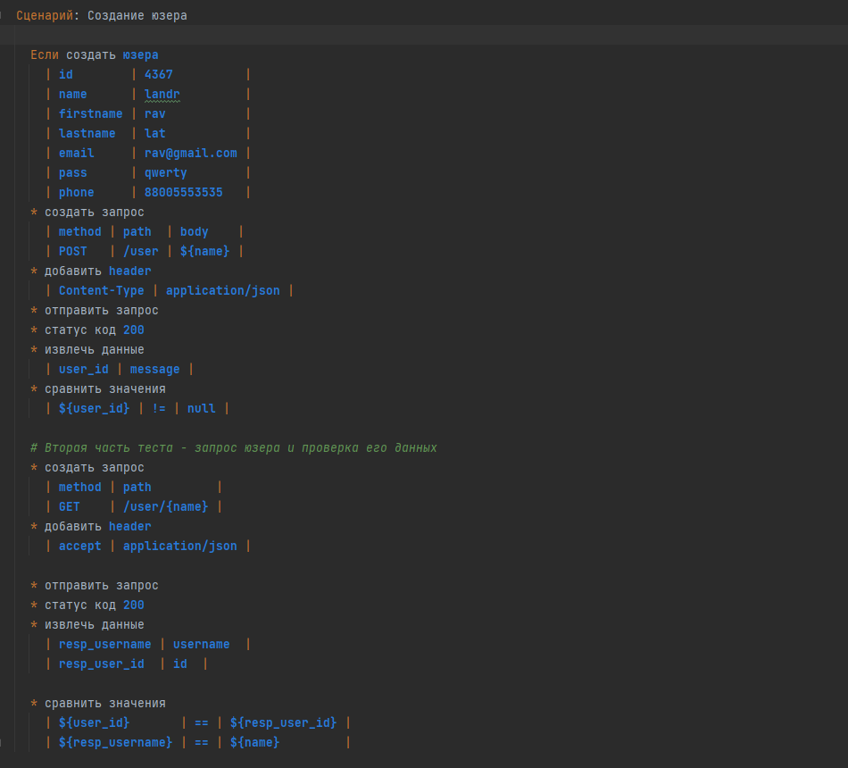
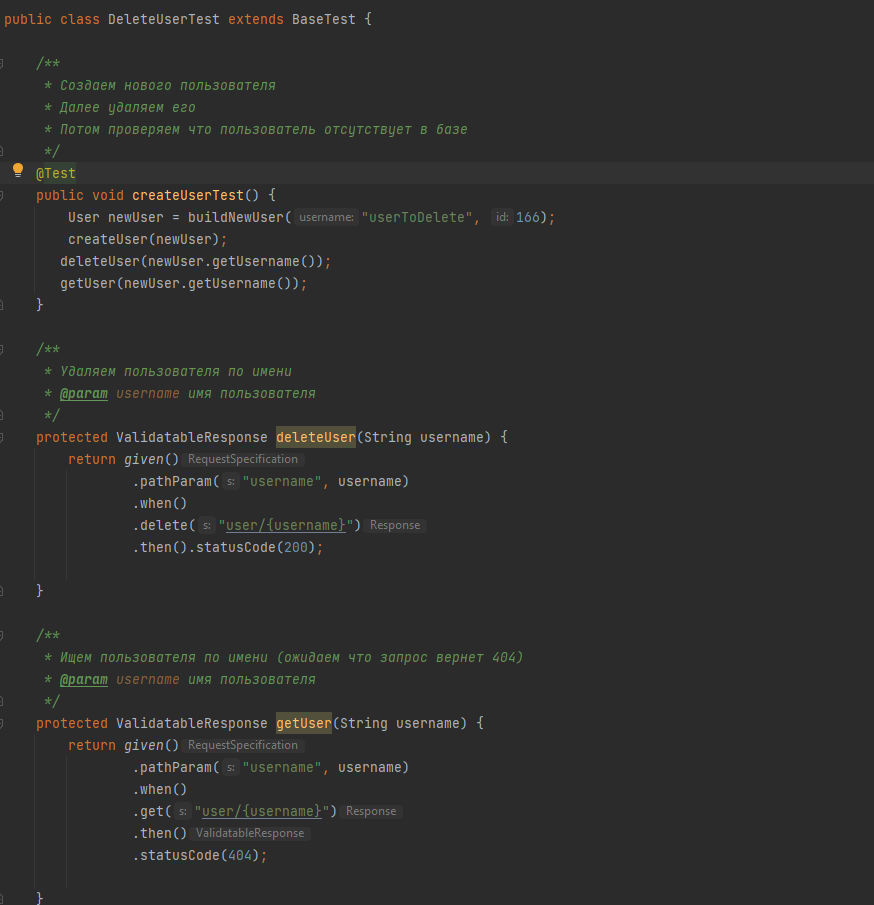

 Пример API тестов. Тесты написаны как на чистой Java с RestAssured, так и на Gherkin с помощью простенького BDD фреймворка.
 В проекте тестируются API запросы в сервис PetStore (https://petstore.swagger.io/v2/)
 Для работы потребуется Java 8 и плагин Cucumber 

 
